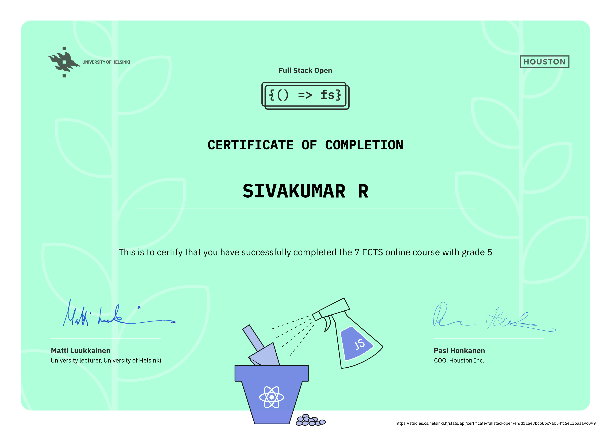

# Full Stack Open: Leveling Up My Skills!

Welcome to my journey through the Full Stack Open course! This repository is a celebration of my progress, documenting the exercises, projects, and new skills I've unlocked. I'm building modern web applications from the ground up, one part at a time.

---

### **Progress Tracker**

Check out the table below to see what I've accomplished so far! It's been a wild ride of learning, debugging, and building.

| Part | Topic | Status |
|:---:|:---|:---:|
| 1 | Introduction to React | ✅ |
| 2 | Communicating with the Server | ✅ |
| 3 | Programming Node.js and Express | ✅ |
| 4 | Testing Express Servers, User Accounts | ✅ |
| 5 | Testing React Apps | ✅ |
| 6 | State Management with Redux | ✅ |
| 7 | React Router, Webpack | ✅ |

---

### **What I've Conquered So Far!**

This course is all about building a solid foundation, and I'm proud of the skills I've gained. Here's a brief summary of what I've tackled in each part:

* **Part 1: The React Realm** - This is where I learned to think in components! I built my first dynamic user interfaces and got comfortable with props and state.
* **Part 2: The Server Speaks** - I moved beyond static data and learned how to talk to a server. I built a simple phonebook and saw how to manage forms and use `axios` to get, add, and update data.
* **Part 3: Backend Bonanza** - This was my first foray into the backend. I used **Node.js** and **Express** to create my very own REST API and connected it to a **MongoDB** database.
* **Part 4: The Art of Authentication** - I learned how to secure my backend by adding user accounts and creating a login system with **JWTs**. I also got into the nitty-gritty of **backend testing**.
* **Part 5: React Under the Microscope** - Here, I learned how to build robust and reliable applications by writing tests for my **React components**. No bug is safe now!
* **Part 6: Redux Power!** - State management was a game-changer. I used **Redux Toolkit** to handle complex application state in a predictable way.
* **Part 7: Routing and Bundling** - I made my single-page applications feel like multi-page websites using **React Router**. I also learned the magic of **Webpack** for bundling and optimizing my code.

### Full Stack Open: core course

### **What's Next?**

The journey continues! I'm ready to take on the remaining parts, including topics like GraphQL and TypeScript. Stay tuned for more updates as I keep building!
